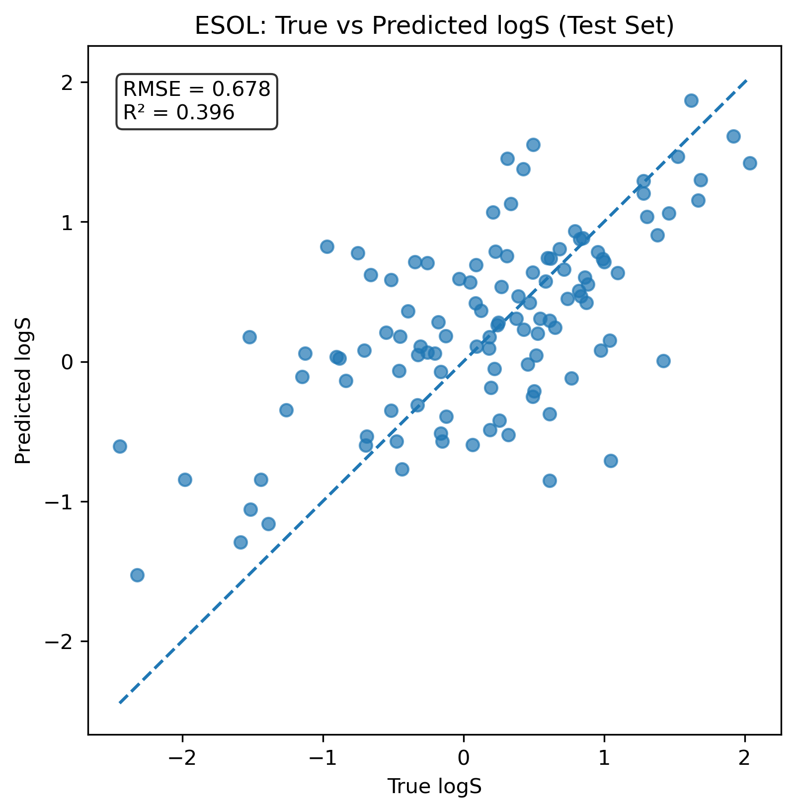

# Graph Neural Network for Molecular Solubility Prediction (ESOL)

## Overview

This project implements a Graph Neural Network (GNN) in PyTorch Geometric to predict aqueous solubility (logS) of small molecules using the ESOL dataset (MoleculeNet).

Molecules are represented as graphs:
- Nodes: atoms with RDKit-derived features
- Edges: chemical bonds

The model is trained using a standard train/validation/test split and evaluated using RMSE and R².

## Dataset

- Source: ESOL (Delaney) dataset from MoleculeNet
- ~1100 small molecules
- Target: Experimental aqueous solubility (logS)

Each molecule is represented as a SMILES string and converted to a graph using RDKit.

## Model Architecture

The model consists of:

- Multiple GCNConv graph convolution layers
- ReLU activations
- Global mean pooling to obtain a molecule-level representation
- A fully connected MLP regression head

The network predicts a single scalar value (logS) per molecule.

## Training Procedure

- Train/Validation/Test split: 80% / 10% / 10%
- Loss function: Mean Squared Error (MSE)
- Optimizer: Adam (learning rate = 1e-3)
- Model selection based on lowest validation RMSE
- Final performance evaluated on held-out test set

## Results

Test set performance:

- RMSE: 0.68
- R²: 0.40

The GNN outperformed baseline linear regression and random forest models trained on classical RDKit descriptors.

Example: True vs Predicted logS

## Project Structure

├── data/  
│   ├── raw/  
│   └── processed/  
├── src/  
│   ├── dataset.py  
│   ├── featurization.py  
│   ├── models.py  
│   ├── train.py  
│   └── utils.py  
├── notebooks/  
│   └── 02_results_analysis.py  
├── results/  
│   ├── models/  
│   └── figures/  
└── README.md

## How to Run

Create environment:

conda create -n gnn-esol python=3.11  
conda activate gnn-esol  
pip install -r requirements.txt  

Train model:

python -m src.train  

Evaluate and generate plots:

python notebooks/02_results_analysis.py

## Future Work

- Implement GINConv and compare architectures
- Perform scaffold-based splitting for improved generalization assessment
- Apply model to additional MoleculeNet datasets (FreeSolv, Lipophilicity)
- Explore generative modeling for molecule optimization
